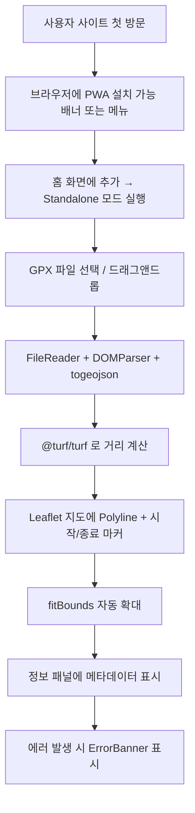

# GPX 뷰어 웹앱 PRD (Product Requirements Document) — 2차 목표

## 1. 제품 개요

GPX 뷰어는 서버 없이 브라우저에서만 동작하는 모바일 최적형 PWA(Point Web App)이다. 모바일 또는 PC 브라우저에서 `.gpx` 파일을 업로드하면 Leaflet 지도 위에 경로가 표시되고, 기본 경로 정보(거리, 시작/종료 좌표, 포인트 개수)가 제공된다. PWA 로 패키징되어 홈 화면에 앱처럼 설치할 수 있으며, Vercel/Netlify 같은 정적 호스팅에 그대로 배포 가능하다.

- **대상 사용자**: 등산·라이딩·러닝 등 야외 활동 후 GPX 기록을 모바일에서 빠르게 확인하고 싶은 일반 사용자
- **핵심 가치**: 설치 없이(또는 PWA 홈화면 설치 후) 모바일 친화적인 UI 로 GPX 경로를 시각화
- **2차 목표 차별점**:
  1. 모바일 우선 반응형 (PC ↔ 모바일 시멘틱 일관)
  2. PWA (홈화면 추가, 오프라인 셸 캐시)
  3. 정적 클라우드 배포 가능 (Vercel/Netlify)

## 2. 핵심 기능

### 2.1 사용자 역할

| 역할 | 권한 |
|------|------|
| 비로그인 일반 사용자 | GPX 파일 업로드, 지도에서 경로 확인, 정보 패널 조회, PWA 설치(가능 시) |

### 2.2 기능 모듈

1. **메인 뷰어 페이지 (단일 라우트 `/`)**
2. **상단 AppBar**: 로고/타이틀, GPX 업로드 버튼, 모바일에서는 파일명 칩 표시
3. **모바일 하단 시트 (Bottom Sheet)**: 정보 패널 - 핸들로 드래그하여 확장 가능
4. **데스크탑 좌측 사이드바**: 정보 패널 - 320~360px 고정
5. **지도 영역 (MapViewer)**: Leaflet + 트랙 폴리라인 + 시작/종료 마커
6. **에러 배너 (ErrorBanner)**: 상단 슬림 배너
7. **PWA 셸**: manifest + 아이콘 + service worker

### 2.3 페이지 상세

| 페이지 | 모듈 | 기능 설명 |
|--------|------|----------|
| 메인 | AppBar | sticky 상단, 모바일 safe-area 대응, 업로드 버튼 터치영역 44px 이상 |
| 메인 | GpxUploader | 파일 선택 + 드래그앤드롭, 모바일에서는 "사진에서 선택" 도 가능 |
| 메인 | EmptyState | 업로드 전 안내 카드 |
| 메인 | MapViewer | Polyline, 마커, fitBounds 자동, 모바일에서 pinch-zoom 활성화 |
| 메인 | RouteInfoPanel (Desktop) | 좌측 사이드바, 스크롤 |
| 메인 | RouteInfoPanel (Mobile) | 하단 시트, 기본은 peek(접힘) 상태, 위로 스와이프 시 확장 |
| 메인 | ErrorBanner | 상단 슬림 배너, dismiss 가능 |

## 3. 핵심 플로우

## 4. UI/UX 디자인

### 4.1 디자인 스타일

- **모바일 우선**: iOS safe-area, Android 노치 대응
- **컬러 팔레트**:
  - Background: `#0F1419` (다크 베이스)
  - Surface: `#1A1F26`
  - Primary Accent: `#F97316` (트레일 오렌지)
  - Secondary Accent: `#22D3EE` (시작 마커 시안)
- **타이포그래피**: Space Grotesk (제목) + JetBrains Mono (수치) + Inter (본문)
- **터치 타깃**: 최소 44x44px
- **모션**: 바텀시트 스프링(transition), 패널 진입 stagger

### 4.2 반응형

| 뷰포트 | 레이아웃 |
|--------|---------|
| 모바일 (< 768px) | 세로: AppBar → 지도(60vh) → 하단 정보 시트(peek) |
| 태블릿 (768~1023px) | 세로: AppBar → 지도(70vh) → 하단 정보 시트(peek/expnad) |
| PC (>= 1024px) | 좌우: 좌측 정보 패널 340px / 우측 지도 flex-1 |

## 5. PWA 요구사항

1. **manifest.webmanifest** 또는 manifest.json: name, short_name, start_url, scope, display=standalone, theme_color, background_color, icons(192/512/maskable)
2. **Service Worker**: `vite-plugin-pwa` 사용
   - 정적 자산 precache
   - 런타임 캐시: 지도 타일(StaleWhileRevalidate)
   - 자동 업데이트 + 사용자 알림
3. **아이콘 세트**:
   - `favicon.svg` (벡터 파비콘)
   - `pwa-192x192.png`, `pwa-512x512.png`
   - `apple-touch-icon.png` (180x180)
   - `maskable-icon.png` (512x512)
4. **설치 가능성**: HTTPS(또는 localhost), manifest 유효, SW 등록 완료, 아이콘 제공

## 6. 배포 요구사항

- **Vercel**: 정적 빌드 (`dist/`) 만 배포, SPA 라우팅을 위해 `vercel.json` 에 rewrites
- **Netlify**: `_redirects` 파일로 `/* → /index.html 200` 처리
- **빌드 명령**: `npm run build`
- **출력 폴더**: `dist`
- **환경 변수**: 없음 (백엔드 없음)

## 7. 예외 처리

1. GPX 아님: "GPX 파일만 업로드할 수 있습니다."
2. 트랙 없음: "표시할 경로 데이터가 없습니다."
3. 파싱 실패: "파싱 중 오류가 발생했습니다."
4. SW 등록 실패: 콘솔 경고 + 화면 영향 없음 (조용히 실패)

## 8. 비기능 요구사항

- **Lighthouse PWA 점수**: manifest + SW + icons 모두 충족
- **오프라인 셸**: 라우트 자체는 캐시되어야 하지만, GPX 파싱/지도 타일은 온라인 권장
- **접근성**: 업로드 label, ARIA, 키보드 내비게이션, prefers-reduced-motion 존중
