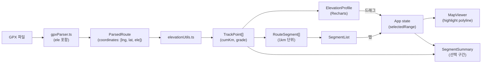

# GPX 뷰어 — 구간 고도 분석 기술 아키텍처 (3차 목표)

## 1. 데이터 흐름

## 2. 수정 / 추가 파일

| 종류 | 파일 | 비고 |
|------|------|------|
| 수정 | `src/types/gpx.ts` | `TrackPoint`, `ElevationPoint`, `RouteSegment`, `SegmentSelection` 추가 |
| 수정 | `src/utils/gpxParser.ts` | LineString 좌표에 ele 포함 (3번째 원소), `buildRouteMetadata` 시그니처 확장 |
| 신규 | `src/utils/elevationUtils.ts` | `buildTrackPoints`, `computeSegments`, `computeSelectionStats` |
| 신규 | `src/components/ElevationProfile.tsx` | Recharts AreaChart + Brush + click/drag selection |
| 신규 | `src/components/SegmentList.tsx` | 세로 스크롤 리스트, 탭 시 선택 |
| 신규 | `src/components/SegmentSummary.tsx` | 선택 구간 핵심 지표 카드 |
| 수정 | `src/components/MapViewer.tsx` | `selectedRange` prop 받아 하이라이트 polyline 그리기 |
| 수정 | `src/components/RouteInfoPanel.tsx` | 새 prop `summary?: SegmentStats` |
| 수정 | `src/components/MobileBottomSheet.tsx` | 탭 UI 추가 (정보/차트/구간) |
| 수정 | `src/App.tsx` | `selectedRange` 상태, 통계 계산, 자식에 prop 전달 |
| 신규 | `public/sample-bukhansan.gpx` | (선택) ele 값 보강 |

## 3. 의존성

- `recharts` ^2.13.x (의존성 추가)
- 추가 런타임 라이브러리는 없음

## 4. 차트 라이브러리 선택 — Recharts

이유:
- React 18 / TS 와 자연스럽게 통합 (선언형)
- `AreaChart`, `ReferenceArea`(구간 강조), `Tooltip`, `Brush` 모두 지원
- 가벼움(트리쉐이킹 OK), 다크 테마 커스터마이징 용이
- 모바일 터치 이벤트도 합리적으로 지원

## 5. 알고리즘 개요

### 5.1 누적 거리 / 경사도
- 인접 좌표 쌍의 turf `distance` 로 누적 km 산출
- 경사 = `Δelevation / Δdistance × 100` (단위: %)

### 5.2 상승/하강 고도
- 인접 고도 차이의 **양수 누적 = gain**, 음수 절댓값 누적 = loss
- 작은 노이즈(±0.5m) 는 무시해 cyclist-friendly 한 값 산출

### 5.3 구간화 (1km 단위)
- 누적 거리가 1km 단위로 넘어지는 좌표 인덱스를 찾아 `RouteSegment[]` 생성
- 구간 통계: `distanceKm`, `elevationGainM`, `elevationLossM`, `avgGradePercent`, `maxGradePercent`

### 5.4 선택 하이라이트
- `selectedRange = { startIndex, endIndex }` 일 때
  - Map: 해당 인덱스 범위 좌표로 별도 polyline (밝은 노란색, 굵게)
  - Chart: `ReferenceArea` 로 배경 음영
  - Summary: 선택 구간 통계 표시

## 6. 데이터 다운샘플링 전략

GPX 1만점 이상에서는 Recharts 렌더 부담이 커질 수 있다. 2000점 초과 시 LTTB(Largest-Triangle-Three-Buckets) 또는 단순 균등 샘플링으로 다운샘플한다. 이때 **고도 극값(피크/밸리)** 은 보존하도록 보정한다. 시작/종료점은 항상 포함.

## 7. 모바일 UX

- 차트: 가로 스크롤(Recharts `Brush` + 가로 너비 부모 fit) + 두 손가락 핀치 줌(간단화: 더블탭 시 1km 단위 줌)
- 시트 탭 구조: `정보` / `차트` / `구간` 3 탭
- 세그먼트 리스트는 최대높이 35vh, 그 이상은 가상 스크롤 또는 "더 보기" 토글

## 8. 호환성 / 위험

| 위험 | 대응 |
|------|------|
| 기존 지도 fitBounds 로직과 선택구간 pan/zoom 충돌 | `selectedRange` 가 있을 때는 fitBounds 호출 스킵 |
| `ele` 없는 GPX | elevation 0 으로 처리, UI 에 "고도 정보 없음" 표시 |
| Recharts 번들 크기 증가 | `recharts` 만 추가 (gzip 30~40KB 정도) |
| 색상 테마 충돌 | `tailwind.config` 의 토큰 재사용, 차트 색상은 `colors.ink`/`accent`/`trail` |
| 모바일 pinch + Leaflet 충돌 | 시트 안의 차트는 Leaflet 외부, 별도 컨테이너에서 터치 이벤트 처리 |

## 9. 단계별 작업 순서

1. `recharts` 설치
2. `types/gpx.ts` 확장
3. `gpxParser.ts` ele 추출
4. `elevationUtils.ts` 신규
5. `ElevationProfile` / `SegmentList` / `SegmentSummary` 신규
6. `MapViewer` 하이라이트 지원
7. `App.tsx` 상태·통계 통합
8. `MobileBottomSheet` 탭 구조
9. 샘플 GPX 보강
10. `npm run build` / preview 검증
