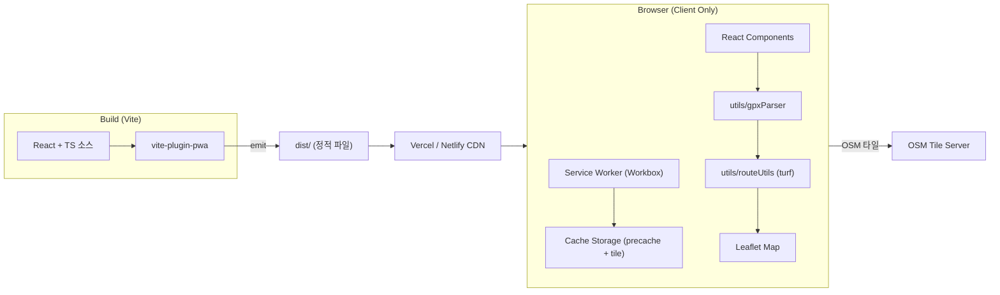

# GPX 뷰어 웹앱 기술 아키텍처 문서 — 2차 목표

## 1. 아키텍처 설계

순수 클라이언트 PWA 구조. Vite 가 정적 산출물을 만들고, Vercel/Netlify 가 그것을 HTTPS 로 호스팅한다. PWA manifest + service worker 가 브라우저에서 "홈 화면에 추가"를 가능하게 한다.



## 2. 기술 스택 (2차)

- **프레임워크**: React 18 + Vite 5 (변경 없음)
- **언어**: TypeScript (ES2020 이하)
- **스타일**: Tailwind CSS 3
- **상태 관리**: React `useState`
- **지도**: Leaflet + react-leaflet
- **데이터**: @tmcw/togeojson, @turf/turf
- **아이콘**: lucide-react
- **PWA**: **vite-plugin-pwa** (Workbox 기반, 가장 안정적)
- **배포**: Vercel/Netlify (정적 호스팅)
- **라우팅**: 없음(단일 페이지). 단, SPA 라우팅 fallback 필요

## 3. 의존성 (package.json)

### dependencies
- `react`, `react-dom`
- `leaflet`, `react-leaflet`
- `@tmcw/togeojson`
- `@turf/turf`
- `lucide-react`

### devDependencies
- `@types/leaflet`, `@types/react`, `@types/react-dom`
- `vite`, `@vitejs/plugin-react`
- `typescript`
- `tailwindcss`, `postcss`, `autoprefixer`
- **`vite-plugin-pwa`** (신규)
- **`workbox-window`** (신규, 옵셔널)

## 4. PWA 설정 상세

### vite.config.ts 핵심

```ts
import { VitePWA } from 'vite-plugin-pwa'

VitePWA({
  registerType: 'autoUpdate',
  includeAssets: ['favicon.svg', 'apple-touch-icon.png'],
  manifest: {
    name: 'GPX 뷰어',
    short_name: 'GPX 뷰어',
    description: '브라우저에서 GPX 경로를 시각화하는 미니멀 PWA',
    theme_color: '#0F1419',
    background_color: '#0F1419',
    display: 'standalone',
    start_url: '/',
    scope: '/',
    lang: 'ko',
    icons: [
      { src: 'pwa-192x192.png', sizes: '192x192', type: 'image/png' },
      { src: 'pwa-512x512.png', sizes: '512x512', type: 'image/png' },
      { src: 'maskable-icon-512x512.png', sizes: '512x512', type: 'image/png', purpose: 'maskable' }
    ]
  },
  workbox: {
    globPatterns: ['**/*.{js,css,html,svg,png,ico,webmanifest}'],
    runtimeCaching: [
      {
        urlPattern: ({ url }) => url.origin.includes('tile.openstreetmap.org'),
        handler: 'StaleWhileRevalidate',
        options: {
          cacheName: 'osm-tiles',
          expiration: { maxEntries: 200, maxAgeSeconds: 60 * 60 * 24 * 30 }
        }
      }
    ]
  }
})
```

## 5. 라우팅 (SPA fallback)

### Vercel (`vercel.json`)
```json
{
  "rewrites": [{ "source": "/(.*)", "destination": "/index.html" }]
}
```

### Netlify (`public/_redirects`)
```
/* /index.html 200
```

## 6. 폴더 구조 (2차)

```
e:\Pjt\GPX\
├── public/
│   ├── favicon.svg
│   ├── apple-touch-icon.png          (신규, 180x180)
│   ├── pwa-192x192.png               (신규)
│   ├── pwa-512x512.png               (신규)
│   ├── maskable-icon-512x512.png     (신규)
│   ├── sample-bukhansan.gpx
│   └── _redirects                    (Netlify SPA fallback)
├── src/
│   ├── components/
│   │   ├── GpxUploader.tsx
│   │   ├── MapViewer.tsx
│   │   ├── RouteInfoPanel.tsx
│   │   └── MobileBottomSheet.tsx     (신규, 모바일 하단 시트)
│   ├── hooks/
│   │   └── useMediaQuery.ts          (신규, 반응형 분기)
│   ├── utils/
│   │   ├── gpxParser.ts
│   │   └── routeUtils.ts
│   ├── types/
│   │   └── gpx.ts
│   ├── App.tsx
│   ├── main.tsx
│   └── index.css
├── vercel.json                       (신규)
├── README.md                         (신규)
├── index.html
├── package.json
├── tsconfig*.json
├── vite.config.ts                    (PWA 설정 추가)
├── tailwind.config.js
└── postcss.config.js
```

## 7. 모바일 UX 개선 (구체)

- 상단 AppBar: `pt-[env(safe-area-inset-top)]` 로 iOS 노치 대응
- 하단 시트:
  - 기본 높이 32vh
  - 핸들(드래그바) 표시
  - 확장 시 70vh
  - backdrop 반투명
- 터치 영역: 업로드 버튼 ≥ 44px, 파일명 칩 ≥ 36px
- Leaflet 모바일: `tap: true`, `zoomControl` 위치 조정

## 8. README.md 구조

1. 프로젝트 소개
2. 데모 스크린샷(텍스트 자리)
3. 주요 기능
4. 기술 스택
5. 로컬 실행
6. 빌드 / 미리보기
7. PWA 설치 안내
8. Vercel 배포 (CLI / GitHub 연동)
9. Netlify 배포
10. 폴더 구조
11. 주의 사항 (OSM 타일 정책)

## 9. 완료 기준 (Acceptance)

1. `npm install`, `npm run dev`, `npm run build`, `npm run preview` 모두 정상
2. 모바일/PC 모두 UI 자연스러움 (반응형 분기)
3. PWA manifest 유효, service worker 등록, 아이콘 192/512/maskable 제공
4. Lighthouse "Installable" 통과
5. Vercel/Netlify 에 그대로 배포 가능, SPA 라우팅 fallback 동작
6. README 에 실행/빌드/배포 절차 포함
7. GPX 파싱은 여전히 클라이언트 only, 데이터 외부 전송 없음
